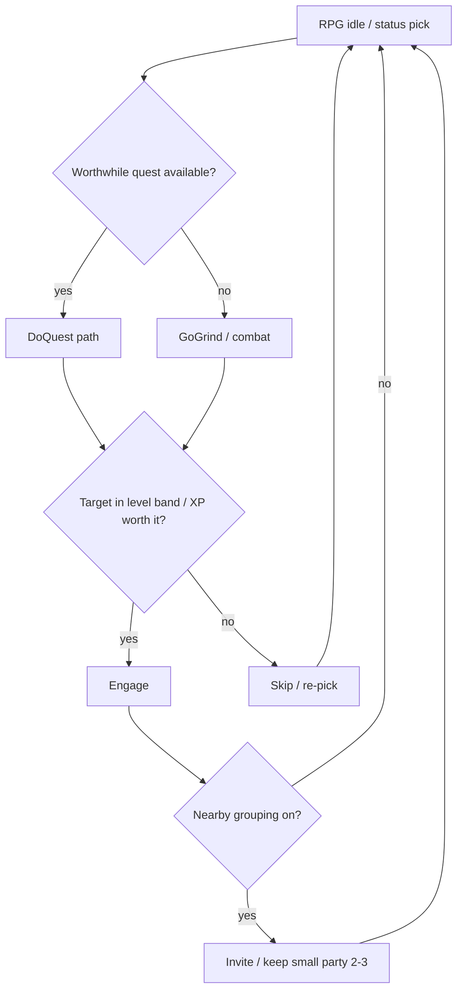
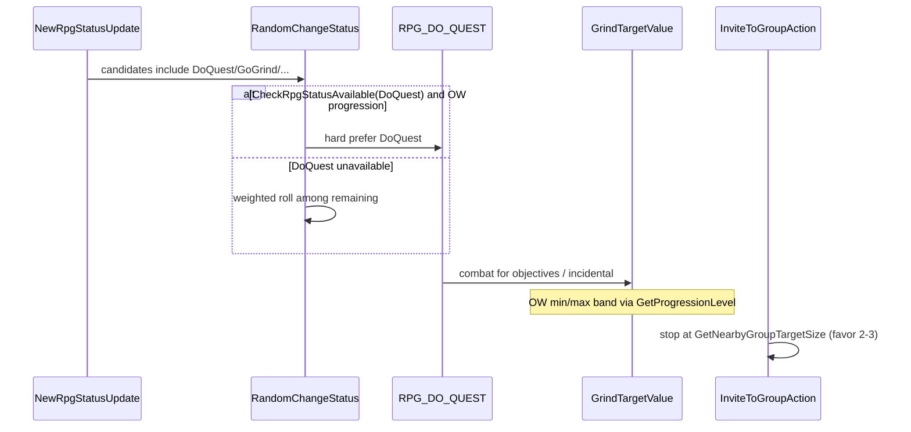

# Bot Progression Decision Loop - Plan

## Goal Capsule

**Objective:** Make random bots level meaningfully faster on long uptimes by fixing quest vs grind, target level band, and ambient group size / group XP decisions so they optimize XP like real players.

**Product authority:** `STRATEGY.md` — quest-first progression, tight level bands, group XP as first-class with partial ambient parties; primary user is a solo private-server player who wants the open world populated with bots that level and quest like real players.

**Open blockers:** None. Success after ~18h is judged by eyeballing the level ceiling vs today's ~27–28 (no hard numeric target pinned).

## Product Contract

### Summary

Improve random-bot open-world progression by fixing the existing decision loop across all three strategy tracks — quest vs grind, grind/target level selection, and ambient group size / group XP — so after a long uptime (~18h) bots reach a clearly higher level ceiling than today's ~27–28. Prefer better task choice over knobs-only or a new shared XP framework.

### Problem Frame

After ~18 hours of server uptime, the highest random bots sit around level 27–28. They are not stuck in place; they fail to optimize questing and XP work, and areas can look oversaturated. Solo players on private WotLK servers want bots that look like real players leveling. Wrong-level targets (solo or in groups where XP is wasted) and weak questing make progression feel off even when bots keep moving.

### Key Decisions

- **Behavior over knobs-only.** Conf tuning may accompany the work, but the product bet is better quest/grind/group decisions — not only raising `DoQuest` weights.
- **All three strategy tracks in one slice.** Quest progression, target/level selection, and group XP & party size ship together as one decision-loop improvement.
- **Faster leveling is the primary win.** Area spread and sensible group sizes are supporting eyeball checks, not separate success bars with numeric targets.
- **Extend existing New RPG / grind / GroupNearby paths.** Do not invent a single shared "XP efficiency" gate (Approach C) in this slice.
- **Hard prefer DoQuest.** When a worthwhile progression quest is available, pick DoQuest instead of rolling grind/wander (planning confirmation).

### Actors

- **Random bot (solo)** — chooses RPG status (quest vs grind), picks grind targets, relocates when stagnating.
- **Random bot (ambient nearby-group leader)** — drives open-world progression for the party; invites and sizes the group.
- **Random bot (ambient nearby-group member)** — follows/assists; does not independently drive open-world progression decisions the same way as the leader.
- **Solo real player (observer)** — eyeballs leveling speed, zone spread, and group sizes; does not need new UI.

### Key Flows

1. **Quest-preferred work pick** — When a bot (solo or nearby-group leader) has worthwhile progression quests available, it prefers quest work over grind/wander for XP.
2. **Level-band combat** — When grinding or fighting for quests, the bot prefers targets in a tight level band relative to progression level and avoids fights that waste XP (grey/green or badly mismatched).
3. **Ambient party sizing** — When RandomBotGroupNearby is enabled, leaders form and keep small parties (favor 2–3 over filling to 4–5) so group XP rules do not tank progression; parties that no longer serve progression leave or reform.
4. **Long-uptime eyeball** — After a comparable ~18h run, the observer compares max bot level (and supporting spread/group-size impressions) to the prior ~27–28 ceiling.

### Requirements

**Quest progression**

- R1. Solo random bots and ambient nearby-group leaders prefer quest XP work over grind when they have worthwhile, non-trivial progression quests available.
- R2. Quests that are trivial or below progression level are not treated as worthwhile progression work (existing worth checks stay the source of truth; behavior must actually follow them when choosing status/work).

**Target / level selection**

- R3. Open-world grind and combat target selection keep mobs in a tight level band relative to progression level so XP is not wasted on badly under-level targets (unless the mob is needed for an active quest).
- R4. Nearby-group leaders use party-aware progression level for those band decisions so the group does not grind content that only suits the lowest or highest outlier.

**Group XP & party size**

- R5. When RandomBotGroupNearby is enabled, ambient parties favor small sizes (typically 2–3) over filling toward 4–5, so group XP dilution does not dominate progression.
- R6. Ambient parties that no longer serve progression (stale quests, wrong level, no appropriate work) still leave or reform so bots can resume productive XP work.
- R7. Group-size requirements apply only when RandomBotGroupNearby is enabled; quest and level-band requirements apply with New RPG / open-world progression regardless of grouping.

**Observability / success**

- R8. After a comparable long uptime (~18h), a solo observer can see a clearly higher max bot level than the prior ~27–28 ceiling by eyeballing; area spread and sensible group sizes are supporting impressions, not hard numeric gates.

### Acceptance Examples

- AE1. **When** a solo bot has a worthwhile progression quest and idle RPG status is rolling work, **then** it selects quest work rather than grind/wander as the default XP path.
- AE2. **When** open-world progression is active and a nearby mob is well below the preferred min mob level and is not needed for a quest, **then** grind target selection skips that mob.
- AE3. **When** RandomBotGroupNearby is enabled and a leader is forming an ambient party, **then** the resulting party tends to stay small (2–3) rather than routinely filling to 4–5.
- AE4. **When** RandomBotGroupNearby is disabled, **then** quest-preference and level-band behavior still apply; no ambient group-size behavior is required.
- AE5. **When** the server has been up ~18h after the change, **then** the observer judges max bot level clearly above the prior ~27–28 ceiling (exact target left to observer judgment).

### Success Criteria

- Primary: max random-bot level after ~18h is clearly higher than ~27–28 (eyeball).
- Supporting: bots look less clumped in oversaturated pockets; ambient parties (when enabled) look sensibly sized for XP.
- Non-goal as success bar: no hard numeric level target, no automated metrics dashboard required for this slice.

### Scope Boundaries

**In scope**

- Decision-loop improvements across quest vs grind, grind/target level band, and ambient group size / group XP.
- Conf adjustments that support those behaviors.

**Deferred for later**

- A single shared "XP efficiency" framework consulted by every system (Approach C).
- Hard numeric 18h level targets or automated progression telemetry.
- Dedicated anti-oversaturation / zone-capacity system beyond what better quest/grind/group decisions and existing relocate/leave paths already provide.
- Member bots on the same open-world grind level-band path as leaders (members stay follow/assist in this slice).

**Out of scope**

- Battleground / arena / LFG fill balance.
- Open-world PvP tuning.
- Real-player party / master AI behavior.
- Knobs-only retune with no behavior change (Approach A as the whole solution).

### Dependencies / Assumptions

- New RPG strategy (`EnableNewRpgStrategy`) and open-world progression helpers already exist and remain the substrate.
- Grind level-band filtering and `PlayerbotGroupProgression` helpers already exist; this work makes the loop use them coherently for XP.
- RandomBotGroupNearby may be off by default; group-size wins require it enabled on the realm under test.
- Observer success is qualitative (eyeball), matching `STRATEGY.md` metrics.

### Outstanding Questions

**Deferred to Planning** — resolved in Planning Contract below.

### Sources / Research

- `STRATEGY.md` — target problem, approach, metrics, three tracks.
- Fork README — New RPG, RandomBotGroupNearby, progression-aware leave/relocate.
- Existing surfaces: `PlayerbotGroupProgression`, `GrindTargetValue` open-world band scoring, `NewRpgBaseAction::IsQuestWorthDoing`, `ShouldUseOpenWorldProgression` (non-leaders gated), `RandomBotGroupNearby*` conf keys.

---

## Planning Contract

**Product Contract preservation:** Product Contract unchanged except Key Decisions gained the confirmed **Hard prefer DoQuest** bullet (planning confirmation of R1/AE1).

### Key Technical Decisions

- **KTD1. Hard prefer DoQuest when available.** In `RandomChangeStatus` / idle status pick for bots under `ShouldUseOpenWorldProgression`, if `RPG_DO_QUEST` is in the idle candidate list and `CheckRpgStatusAvailable(RPG_DO_QUEST)` is true, select DoQuest immediately — **bypass the `RpgStatusProbWeight == 0` skip** for that check. Weights still gate the non-DoQuest fallback roll when DoQuest is unavailable. Rationale: today's path is probabilistic only and skips zero-weight statuses before availability checks; AE1 requires quest as the default XP path when worthwhile quests exist.

- **KTD2. Tighten grind band under open-world progression; keep quest-needed exemption.** Keep min-band via `GetPreferredMinMobLevel` / `GetProgressionLevel`. Under OW, reject non-quest mobs above `progressionLevel + 2` (tighter than the generic +4), and score in-band candidates by closeness to progression level (mid-band), not `mobLevel * 100`. Preserve `needForQuest` exemption. Leaders continue to use party-aware progression level (R4).

- **KTD3. Party size via role weights + invite target size.** Bias `RandomBotGroupNearbyGrouperWeight` away from Leader4/Leader5 and ensure `GetNearbyGroupTargetSize` / invite stop conditions favor 2–3. Do not introduce a separate XP-efficiency service. Leave-for-progression (R6) already exists — verify it still works after size bias; do not redesign leave.

- **KTD4. Members stay leader-driven this slice.** Do not extend `ShouldUseOpenWorldProgression` to nearby-group members. Member grey-pull mitigation is deferred.

- **KTD5. World-thread group ops unchanged.** Invite/accept/leave continue through `PlayerbotOperations` / world-thread queue; AI thread must not mutate `Group` directly.

### Assumptions

- Hard prefer applies only when DoQuest is actually available (worth + capable + POI), matching `CheckRpgStatusAvailable(RPG_DO_QUEST)` — not merely "quest in log."
- Conf defaults in `playerbots.conf.dist` will be updated to match the intended 2–3 bias; operators with custom conf must merge.
- No new Google Test harness for this module in this slice; verification is characterization notes + in-game eyeball (~18h).

### High-Level Technical Design

Status pick and grind band are AI-thread decisions. Invite size is AI decision + world-thread apply.

### Alternative Approaches Considered

- **Weights-only quest bias** — rejected; still allows grind to win while quests exist; fails AE1.
- **Shared XP-efficiency gate (Approach C)** — deferred; larger surface than needed for this slice.
- **Conf-only party size** — insufficient alone; invite target size can still roll up to Leader4/5 max.

---

## Implementation Units

### U1. Hard-prefer DoQuest when available

**Goal:** Solo bots and nearby-group leaders under open-world progression select DoQuest whenever it is available, instead of rolling against grind/wander.

**Requirements:** R1, R2 — AE1, AE4

**Dependencies:** None

**Files:**
- Modify: `src/Ai/World/Rpg/Action/NewRpgBaseAction.cpp` (`RandomChangeStatus`, possibly `CheckRpgStatusAvailable` call sites)
- Modify: `src/Ai/World/Rpg/Action/NewRpgAction.cpp` (idle `RandomChangeStatus` candidate list / call site if needed)
- Reference: `src/Bot/RandomPlayerbotMgr.cpp` (`ShouldUseOpenWorldProgression`)

**Approach:** Before the weighted `urand` in `RandomChangeStatus`, when `ShouldUseOpenWorldProgression(bot)` and `RPG_DO_QUEST` is in the candidate list, call `CheckRpgStatusAvailable(RPG_DO_QUEST)` even if its weight is 0; if true, select DoQuest immediately. Leave weights intact for the fallback roll when DoQuest is unavailable. Do not change member bots (they do not drive this status pick the same way).

**Execution note:** Add a short characterization comment or debug log path documenting the hard-prefer branch so eyeball/debug sessions can confirm DoQuest wins when quests exist.

**Patterns to follow:** Existing `CheckRpgStatusAvailable(RPG_DO_QUEST)` and `IsQuestWorthDoing` / capable / POI gates — hard prefer must not bypass those.

**Test scenarios:**
- Covers AE1. Bot with available worthwhile quest under OW progression → status becomes DoQuest without grind winning the roll.
- Covers AE4. Same quest preference with RandomBotGroupNearby disabled.
- DoQuest weight is 0 but CheckRpgStatusAvailable is true under OW → still hard-prefers DoQuest.
- DoQuest unavailable (no POI / not capable) → falls back to weighted roll among remaining statuses.
- Non-OW bot (if any path) → no hard prefer (weights only).

**Verification:** In-game or debug: bot with quest in log and valid POI enters DoQuest from idle rather than GoGrind while that quest remains available.

---

### U2. Tighten open-world grind level band

**Goal:** Grind/combat targets under open-world progression stay in a tight level band relative to progression level so XP is not wasted on under-level (or poorly matched) mobs, while quest-needed mobs remain allowed.

**Requirements:** R3, R4 — AE2

**Dependencies:** None (can parallel U1)

**Files:**
- Modify: `src/Ai/Base/Value/GrindTargetValue.cpp`
- Modify: `src/Bot/RandomPlayerbotMgr.cpp` / `src/Bot/RandomPlayerbotMgr.h` (`PlayerbotGroupProgression::GetPreferredMinMobLevel`; add preferred-max helper if useful)
- Modify: `src/Ai/World/Rpg/Action/NewRpgBaseAction.cpp` (`SelectRandomGrindPos` / `HasAppropriateMobNearby` — use progression level for nearby leaders)

**Approach:** Keep existing min-band skip (`mobLevel < minMobLevel` unless `needForQuest`). Under OW, reject non-quest mobs with `mobLevel > progressionLevel + 2`; score remaining in-band candidates by closeness to progression level (not highest-level-first). Align `SelectRandomGrindPos` / `HasAppropriateMobNearby` with `GetProgressionLevel` for nearby leaders (required, not optional) so hubs match combat band.

**Patterns to follow:** Existing OW block in `GrindTargetValue::FindTargetForGrinding`; `PlayerbotGroupProgression` helpers; `ShouldUseOpenWorldProgression` gate.

**Test scenarios:**
- Covers AE2. Under-band non-quest mob skipped.
- Over-max (`> progressionLevel + 2`) non-quest mob skipped under OW.
- Among in-band mobs, mid-band (near progression level) preferred over +2 edge when both available.
- Quest-needed under-band or over-max mob still selectable.
- Nearby-group leader uses group progression level for band and grind destination (R4).
- No in-band targets → relocate / status change rather than endless under-band camping (see Risk table).
- Attacker already on bot: document whether attacker bypass remains (existing behavior); do not expand scope to rewrite threat unless it blocks XP badly.

**Verification:** Watch a leveling bot: grind pulls are near-level; grey/green trash is rare unless quest-tagged.

---

### U3. Bias ambient parties to 2–3

**Goal:** When RandomBotGroupNearby is enabled, ambient parties favor size 2–3 over routinely filling to 4–5.

**Requirements:** R5, R6, R7 — AE3, AE4

**Dependencies:** None (can parallel U1/U2)

**Files:**
- Modify: `conf/playerbots.conf.dist` (`RandomBotGroupNearbyGrouperWeight.*`, comments)
- Modify: `src/PlayerbotAIConfig.cpp` / `src/PlayerbotAIConfig.h` if new or renamed keys are needed
- Modify: `src/Bot/PlayerbotAI.cpp` (`GetGrouperType`, `GetNearbyGroupTargetSize`)
- Modify: `src/Ai/Base/Actions/InviteToGroupAction.cpp` (stop-at-target-size path; ensure it honors the new bias)
- Reference: `src/Bot/RandomPlayerbotMgr.cpp` (`ShouldLeaveNearbyGroupForProgression`) — smoke that leave still works; change only if size bias breaks it

**Approach:** Lower or zero Leader4/Leader5 weights; keep Solo/Member/Leader2/Leader3 as the mass. Ensure `GetNearbyGroupTargetSize` cannot routinely target 4–5 when the product intent is 2–3 (e.g. clamp max for nearby ambient leaders, or change the uniform roll upper bound). Keep invite/accept on world-thread operations. R6 leave-for-progression: re-verify; no redesign unless broken.

**Patterns to follow:** Existing `GrouperType` enum and invite `targetSize` stop; config key naming `AiPlayerbot.RandomBotGroupNearby*`.

**Test scenarios:**
- Covers AE3. With grouping enabled, formed ambient parties cluster at 2–3 over a sample of leaders.
- Covers AE4. Grouping disabled → no ambient size behavior required; quest/band units still work.
- Leader already at target size → no further invites.
- Leave-for-progression still fires when quests/level stale (R6).

**Verification:** Enable `RandomBotGroupNearby`; sample open-world parties — mostly 2–3, rarely 4–5.

---

### U4. Dist defaults + eyeball verification notes

**Goal:** Ship conf.dist defaults/comments aligned with U1–U3 and a short operator-facing note for the ~18h eyeball check.

**Requirements:** R8 — AE5

**Dependencies:** U1, U2, U3

**Files:**
- Modify: `conf/playerbots.conf.dist` (RPG weight comments if needed; GroupNearby weights; brief progression comment block)
- Modify: `README.md` fork section (optional short "progression decision loop" note — only if dist comments are insufficient)

**Approach:** Document that DoQuest is hard-preferred when available (weights matter when quests are unavailable); document 2–3 party bias; remind operators that GroupNearby must be on to see party-size wins. No automated metrics dashboard.

**Test expectation:** none — documentation/config defaults only; behavioral proof is U1–U3 + AE5 eyeball.

**Verification:** Fresh install / conf merge instructions are clear; AE5 checklist is obvious to the operator.

---

## Verification Contract

**Quality gates**

- Code follows AzerothCore / module style (Allman, 4-space, no AI-thread group mutation).
- `RandomBotGroupNearby = 0` path: quest hard-prefer + grind band still work (AE4).
- `RandomBotGroupNearby = 1` path: parties favor 2–3 (AE3); leave-for-progression still sane (R6).

**Manual / runtime**

- Short session: bots with quests enter DoQuest from idle; grind targets look near-level.
- Long session (~18h): max bot level clearly above prior ~27–28 (AE5); supporting impressions of spread and group size.

**Automated tests**

- No existing module unit tests for these paths. Do not block on adding a full gtest harness in this slice. Prefer debug asserts / LOG_DEBUG breadcrumbs if useful during implementation.

---

## Definition of Done

- U1–U4 complete and consistent with KTDs.
- AE1–AE4 demonstrable in a short session; AE5 judged after a comparable long uptime.
- Product Contract R1–R8 addressed or explicitly deferred (member band deferred in Scope Boundaries).
- Conf.dist updated; no world-thread group safety regressions.
- Plan ready for `ce-work` / implementer without inventing product behavior.

---

## System-Wide Impact

- Touches New RPG status FSM, grind targeting, and ambient invite sizing — core open-world bot feel for random bots.
- Nearby-group members unchanged in progression autonomy (follow/assist); oversized parties should become rarer, which indirectly helps member XP.
- Operators with custom `playerbots.conf` must merge new weight/size defaults.

## Risk Analysis & Mitigation

| Risk | Mitigation |
|---|---|
| Hard prefer DoQuest with bad POI → bots spin on broken quests | Keep existing capable/POI/`lowPriorityQuest` / stagnation relocate; hard prefer only when `CheckRpgStatusAvailable` is true |
| Invite bias fights leave/rejoin churn | Keep rejoin cooldown; verify leave still exits stale parties |
| Tighter grind band → no targets → idle | Fall back to relocate / status change when no in-band mobs; preserve quest-needed exemption |
| AI vs world thread races on invite | Do not change operation queue model |

## Sources & Research

- Local research: New RPG `RandomChangeStatus` is weight-only today; `GrindTargetValue` has OW min-band; `GetNearbyGroupTargetSize` rolls up to GrouperType max; members excluded from `ShouldUseOpenWorldProgression`.
- No `docs/solutions/` institutional learnings found.
- External research skipped — strong local patterns for all three tracks.
